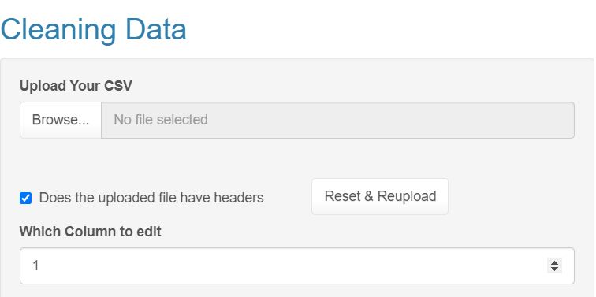
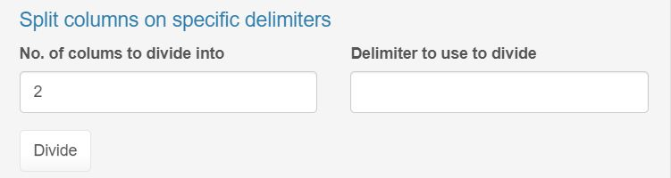
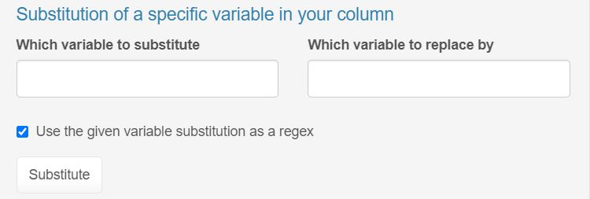
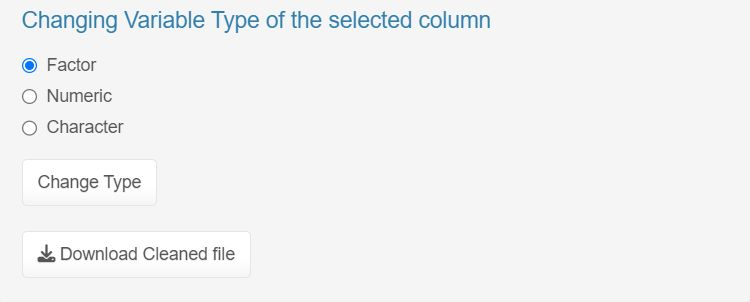

```{r setup, include=FALSE}
knitr::opts_chunk$set(echo = FALSE)
```

## **Cleaning Data Made Easy with Shiny App**

Welcome to our Shiny App that simplifies data cleaning tasks!

### **Cleaning Workflow**

1.  Uploading Your Data

2.  Data Cleaning Functions

    -   Split Columns

    -   Variable Substitution

    -   Changing Variable Types

3.  Downloading Cleaned Data

## **Streamline Data Cleaning Process**

{width="701"}

```{=html}
</br></br>
```
-   Upload your CSV file.

-   Choose whether the file has headers or not.

-   Select the column you want to edit.

## **Split Columns with Ease**



```{=html}
</br></br>
```
-   Specify the delimiter you want to use.

-   Choose the number of columns to divide into.

-   Click "Divide" to split the data.

## **Substitute Values with Precision**



```{=html}
</br></br>
```
-   Enter the variable to be substituted.

-   Provide the new value to replace with.

-   Optionally use regex for advanced substitution.

## **Flexible Variable Type Conversion**



-   Easily change the selected column's type to Factor, Numeric, or Character.

-   Download the cleaned data as a CSV file.

Get started with data cleaning today using the Shiny App! [**Click here to access the app**](https://example.com/shiny_app_link)
